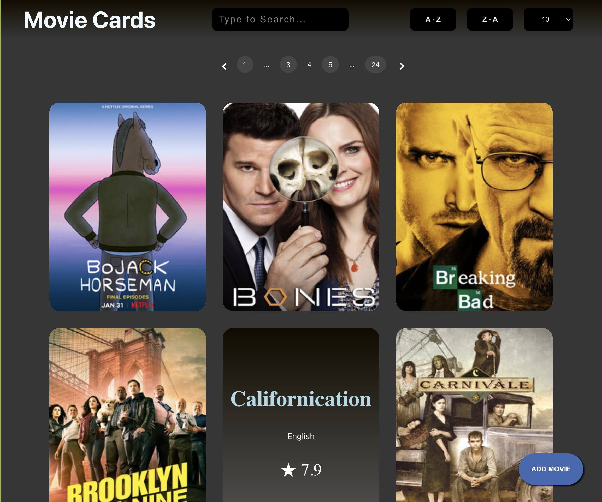

# Mobie React App

This project was bootstrapped with [Create React App](https://github.com/facebook/create-react-app).

## Application Description

> Movie Cards is a react application which displays list of movies.
> Card contains information like name, language, rating, image, and summary fetched from an [API](https://api.tvmaze.com/shows).

## Functionalities:

<ul>
<li>Searching</li> <li>Sorting</li> <li>Adding New Cards</li> <li>Pagination</li> <li>Card Flip</li>
</ul>

## Demo

## Contributors:

>[Sanjay kumar](https://github.com/SSK-14)\
 [Mohanraj Muthukumaran](https://github.com/Mohanraj-Muthukumaran)

## Available Scripts

In the project directory, you can run:

### `npm start`

Runs the app in the development mode.\
Open [http://localhost:3000](http://localhost:3000) to view it in your browser.
